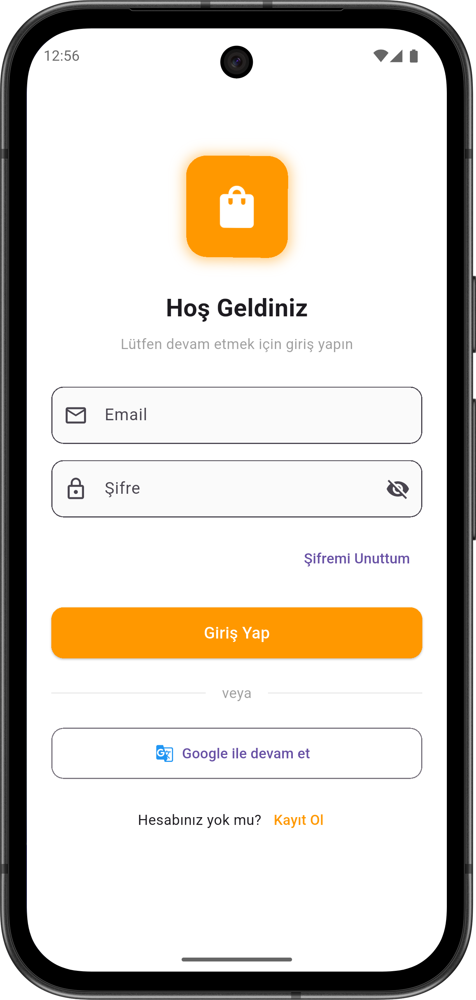
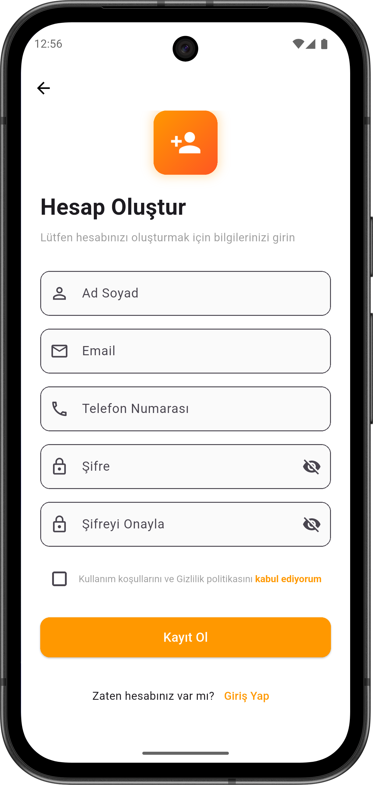
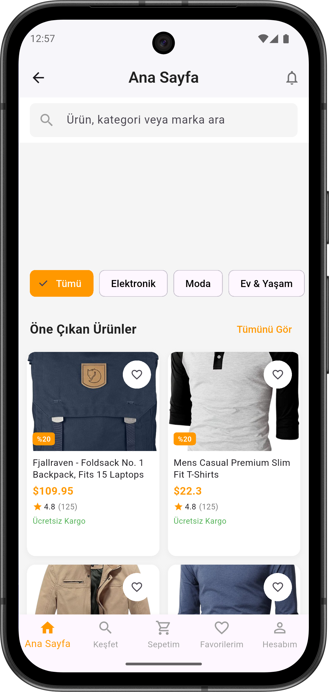
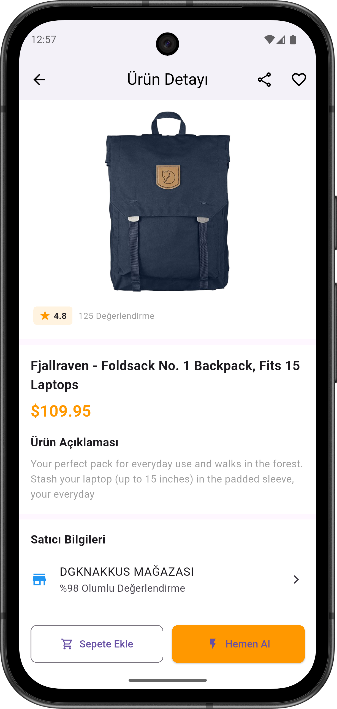
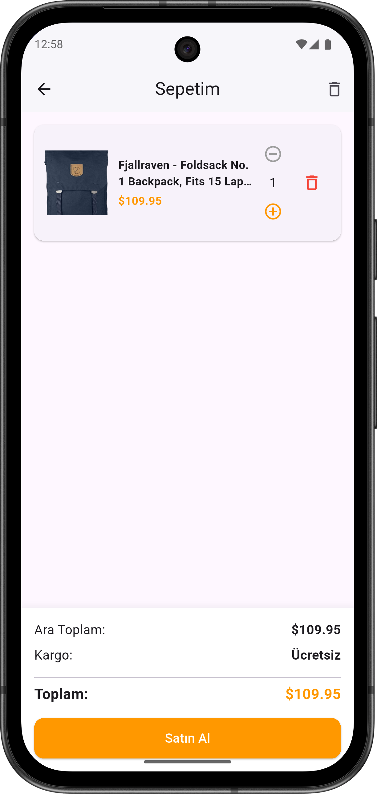
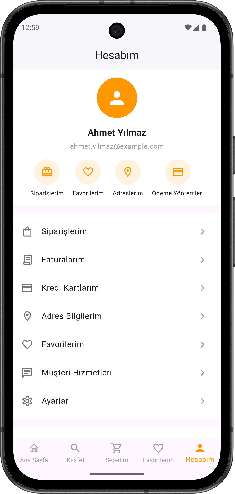

# 🚀 E-Commerce App - DGKNakkus

Flutter **3.32.8** + Dart **3.8.1** ile geliştirilmiş bir **senior level e-commerce demo uygulaması**.  
Amazon, Trendyol, Hepsiburada tarzında **modern UI/UX** ile tasarlandı.  

---

## ✨ Özellikler

- **🔑 Login / Register Sistemi:** Kullanıcı giriş ve kayıt işlemleri, profil yönetimi.  
- **🌐 REST API ile Ürün Çekme:** FakeStoreAPI üzerinden dinamik ürün listesi.  
- **🛒 Sepet İşlemleri:** Ürün ekleme, çıkarma ve toplam fiyat hesaplama.  
- **📦 Detay Sayfası & Hero Animasyonları:** Ürün detaylarını modern animasyonlarla görüntüleme.  
- **🧩 Riverpod ile State Management:** Sepet ve kullanıcı verileri için güvenli ve optimize state management.  
- **📱 Responsive Tasarım:** GridView ile farklı ekran boyutlarına uyumlu layout.  
- **📌 Footer Navbar:** Ana Sayfa, Sepet ve Hesabım arasında hızlı geçiş.  
- **🎨 Modern UI/UX:** Amazon, Trendyol ve Hepsiburada tarzında profesyonel tasarım.

---

## 📸 Ekran Görüntüleri

Login Ekranı:  

Register Ekranı:  

Home Ekranı:  

Ürün Ekranı:  

Sepet Ekranı:  

Hesabım Ekranı:  

