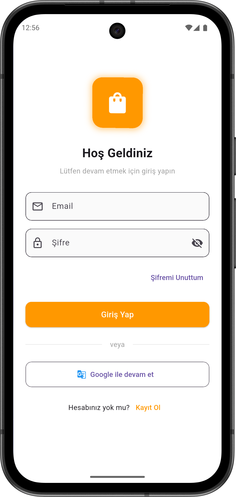
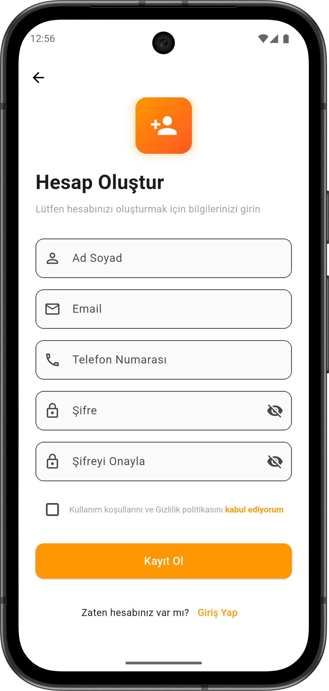
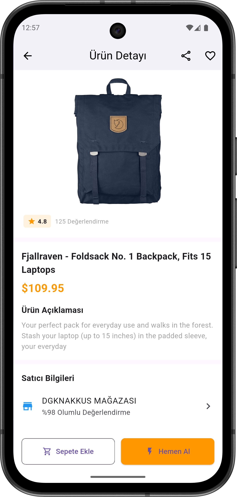
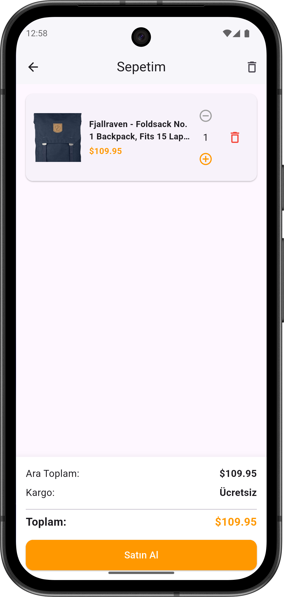
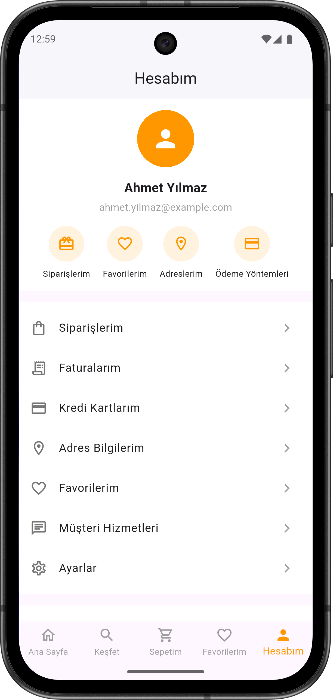

# Lu E-Commerce App - DGKNakkus

Flutter 3.32.8 + Dart 3.8.1 ile geliştirilmiş, senior level e-commerce demo uygulaması.  
Bu proje, global e-ticaret platformu mantığında tasarlanmıştır ve Amazon, Trendyol, Aliexpress gibi uygulamalara benzer modern bir UI/UX sunar.

---

## Özellikler

- **Login / Register sistemi:** Kullanıcı giriş ve kayıt işlemleri, profil yönetimi.
- **REST API ile ürün çekme:** FakeStoreAPI üzerinden dinamik ürün listesi.
- **Sepet işlemleri:** Ürün ekleme, çıkarma ve toplam fiyat hesaplama.
- **Detay sayfası ve Hero animasyonları:** Ürün detaylarını modern animasyonlarla görüntüleme.
- **Riverpod ile state management:** Sepet ve kullanıcı verileri için güvenli ve optimize state management.
- **Responsive tasarım:** GridView ile farklı ekran boyutlarına uyumlu layout.
- **Footer Navbar:** Ana Sayfa, Sepet ve Hesabım arasında hızlı geçiş.
- **Modern UI/UX:** Amazon, Trendyol ve Hepsiburada tarzında profesyonel tasarım.

## 📸 Ekran Görüntüleri

Login Ekranı:  

Register Ekranı:  

Home Ekranı:  

Ürün Ekranı:  

Sepet Ekranı:  

Hesabım Ekranı:  

